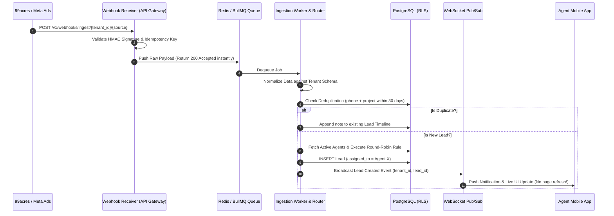
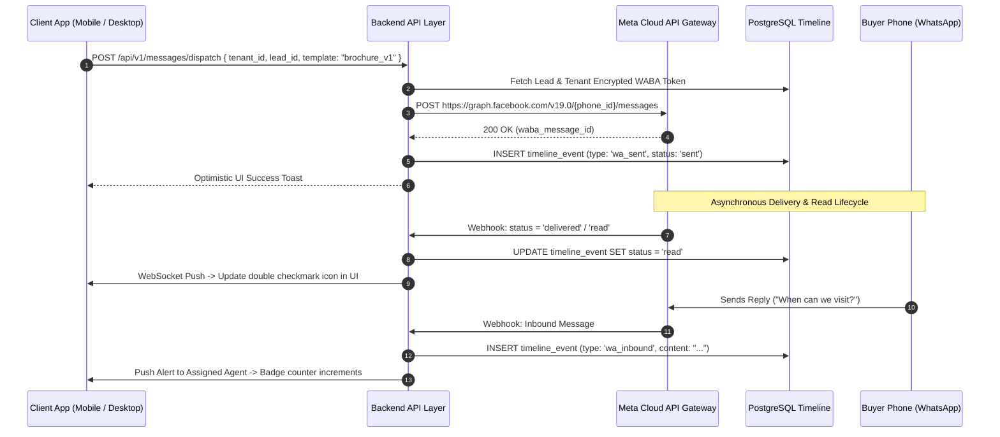
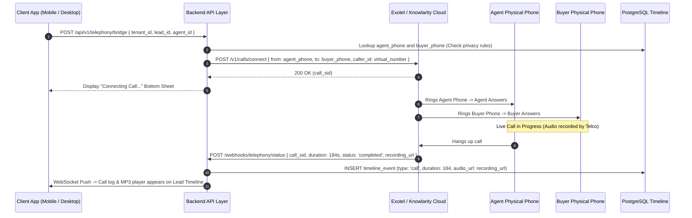
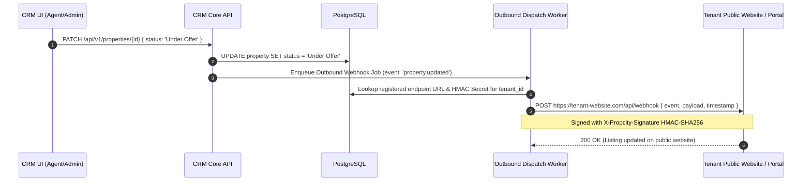
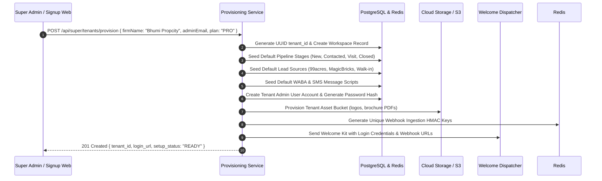

# 🏗️ Bhumi Propcity CRM — Full-Stack Architecture & Core Flow Declaration

> **Purpose:** Establish definitive engineering contracts, system boundaries, and event lifecycles across Frontend, Backend, Integrations, Data Migration, and Super Admin governance. This declaration serves as the immutable, living source of truth to prevent QA regressions, race conditions, and integration debt. As features expand, new specifications must be appended to this document.

---

## 🏛️ 1. System-Wide Architectural Blueprint

The system is designed as a **Metadata-Driven Multi-Tenant SaaS** with strict data isolation, composable frontend rendering, and asynchronous event-driven communications.

```mermaid
graph TD
    subgraph Client Layer [Unified Client Layer]
        Desktop[Desktop Admin Workspace<br>React 19 / Vite]
        Mobile[Mobile Field Agent App<br>React 19 / Vite / PWA]
    end

    subgraph Edge & Gateway [API Gateway & Edge Security]
        CDN[Cloudflare / Vercel Edge CDN]
        Gateway[API Gateway / Auth & Rate Limiter<br>JWT + tenant_id Validation]
    end

    subgraph Core Services [Core Backend Micro-Services]
        AuthSvc[Auth & Tenant Service]
        CRMSvc[Core CRM Service<br>Leads, Props, Team, Timeline]
        RoutingSvc[Lead Routing & Deduplication Engine]
        SyncSvc[Data Import / Export & Merge Engine]
    end

    subgraph Data Layer [Isolated Data & State Layer]
        PG[(PostgreSQL<br>Row-Level Security RLS per tenant)]
        Redis[(Redis Cache & Pub/Sub<br>Session, WebSocket, Live Sync)]
        SQS[(Async Event Queue<br>BullMQ / SQS / Kafka)]
    end

    subgraph Integration Gateways [Communication & Webhook Gateways]
        Ingest[Inbound Webhook Receiver (Pull)<br>99acres, MagicBricks, Meta Ads]
        Outbound[Outbound Webhook Dispatcher (Push)<br>Website Sync, Portal Updates]
        WABA[WhatsApp Cloud API Gateway]
        Telephony[Cloud Telephony Gateway<br>Exotel / Knowlarity / Airtel IQ]
    end

    Desktop & Mobile --> CDN --> Gateway
    Gateway --> AuthSvc & CRMSvc & RoutingSvc & SyncSvc
    CRMSvc & RoutingSvc & SyncSvc --> PG & Redis
    CRMSvc & SyncSvc --> SQS
    SQS --> WABA & Telephony & Outbound
    Ingest --> SQS --> RoutingSvc --> CRMSvc
```

---

## 📜 2. The Core Data Contract & Multi-Tenant Isolation

To prevent QA cycle hell caused by schema mismatches or cross-tenant data leaks, every component must adhere to the **Tenant Schema Declaration**.

### A. Row-Level Security (RLS) Mandate
Every database table (`users`, `leads`, `properties`, `timeline_events`, `message_templates`, `webhooks`, `import_jobs`) MUST contain an indexed `tenant_id` UUID column.
* **Backend Contract:** No database query is permitted without an explicit `WHERE tenant_id = $1` clause enforced at the database driver / ORM middleware layer.
* **Super Admin Contract:** Super Admins bypass RLS only via short-lived, audited impersonation tokens with explicit logging (`super_admin_audit_log`).

### B. The Tenant Config Payload (The Frontend Driver)
Upon authentication, the client receives the **Tenant Config Payload**. The frontend is stateless regarding rules and renders purely based on this declaration:

```json
{
  "tenant_id": "org_bhumi_109",
  "brand": {
    "firmName": "Bhumi Propcity",
    "city": "Pune",
    "theme": { "primary": "#1E6F52", "surface": "#F6F5F2" }
  },
  "features": { "dialer": true, "whatsapp_api": true, "inventory_matching": true, "excel_import": true },
  "pipeline_stages": [
    { "id": "stg_1", "key": "new", "label": "New Inquiry", "color": "#2563EB", "order": 1 },
    { "id": "stg_2", "key": "contacted", "label": "Contacted", "color": "#D97706", "order": 2 },
    { "id": "stg_3", "key": "visit", "label": "Site Visit Done", "color": "#059669", "order": 3 }
  ],
  "lead_sources": ["99acres", "MagicBricks", "Housing.com", "Walk-in", "Meta Ads"],
  "rules": { "require_note_on_stage_change": true, "mask_phone_after_days": 30, "dedup_window_days": 30 }
}
```

---

## 🧩 3. Module-Specific Frontend & Backend Architecture

To ensure scalable team development where adding new features never breaks existing code, all modules must follow the **Self-Contained Plugin Contract**:

### A. Frontend Module Contract (`src/modules/<ModuleName>/`)
* **Isolation:** Each module (e.g., `Leads`, `Properties`, `Calendar`) must export a clean container component and define its own internal sub-components, modal views, and data hooks.
* **Registration:** Modules register their routing key and navigation icon in a central module registry. When the app boots, the navigation rail filters visible modules against `tenant.enabled_modules`.
* **State Access:** Modules never mutate global store directly; they emit typed action intents (e.g., `store.dispatch({ type: 'LEAD_STAGE_UPDATE', payload: { id, stage } })`) which handle optimistic UI updates and rollback on error.

### B. Backend Module Contract (`/api/v1/<module_name>/`)
* **Service Layer Separation:** Route controllers only validate input schemas (Zod/TypeBox) and authenticate JWT tokens. Business logic resides in modular domain services (`LeadService`, `PropertyService`, `MatchingService`).
* **Cross-Module Communication:** Modules never perform direct SQL joins across unrelated domain tables if it breaks modularity. Instead, domain events are published to local internal event buses or Redis pub/sub (e.g., `PropertyService` publishes `property.price_dropped` $\rightarrow$ `MatchingService` catches it and notifies matching buyers).

---

## ⚡ 4. Declaration of Core Integration Flows (Who, What, Where, When, How)

### Flow 1: Automated Lead Ingestion & Round-Robin Routing (Pull)
* **The Problem It Solves:** 99acres, MagicBricks, and Meta Ads send sudden webhook bursts or retry payloads that cause duplicate leads and system freezes.
* **When It Triggers:** A prospective buyer submits an inquiry on a property portal or ad form.



---

### Flow 2: Outbound & Inbound WhatsApp Business (WABA) Communication
* **The Problem It Solves:** Agents copying phone numbers into personal WhatsApp, losing message history, and failing to track read receipts.
* **When It Triggers:** Agent taps **[`WhatsApp`]** or **[`Share Inventory`]** on Mobile or Desktop.



---

### Flow 3: Cloud Telephony Click-to-Call & Audio Recording Sync
* **The Problem It Solves:** Unverified agent call activity and lack of proof regarding buyer negotiations.
* **When It Triggers:** Agent taps **[`Call`]** button on Lead or Property detail page.



---

### Flow 4: Outbound Webhook Dispatch (Push — Live Website & Inventory Sync)
* **The Problem It Solves:** Manual double-data entry when updating property availability, pricing, or status across brokerage websites and partner portals.
* **When It Triggers:** Property unit status changes (e.g., from `Available` to `Under Offer` or `Sold Won`), or pricing/carpet area is modified.



---

### Flow 5: Ecosystem Connectors (Calendar & Payment Links)
* **Calendar Sync (Google / Outlook):** Bi-directional OAuth sync. Scheduling a site visit in the CRM automatically creates a calendar invite for the agent and buyer with Google Maps location coordinates.
* **Payment Links (Razorpay / Stripe / Easebuzz):** Generating instant 1-click token advance payment links sent via WhatsApp. When paid, the webhook automatically moves the property status to `Under Offer`.

---

## 📥 5. Data Import, Export & Deduplication / Merging Engine

Data migration from spreadsheets (Excel/CSV) is the highest-friction step in tenant onboarding. The system implements a bulletproof asynchronous import and conflict resolution engine.

### A. Spreadsheet Import Pipeline (`POST /api/v1/import/jobs`)
1. **Upload & Map:** User uploads `.xlsx` / `.csv`. The backend parses headers and returns a column-mapping proposal (e.g., Sheet column *"Mobile No"* $\rightarrow$ CRM schema `phone_number`).
2. **Async Background Processing:** Large imports (e.g., 10,000 rows) are queued as background jobs to prevent HTTP timeouts.
3. **Validation & Error Reporting:** Invalid rows (missing mandatory phone numbers or invalid budgets) are segregated into an downloadable *"Error Log CSV"* without failing the clean rows.

### B. The Deduplication & Matching Engine
Before inserting any lead or property from webhooks, imports, or manual entry, the system executes the **3-Tier Deduplication Rule**:
1. **Exact Key Match:** Check if `phone_number` or `email` already exists under `tenant_id`.
2. **Project Interest Window:** If exact phone exists, check if the inquiry is within `dedup_window_days` (default 30 days) for the same property project.
3. **Fuzzy Name Match:** Levenshtein distance matching on buyer names to flag potential family member duplicates.

### C. Automated Merging Decisions
When a duplicate lead is detected from a new source (e.g., existing lead *Aarav Sharma* inquires again on 99acres):
* **No Overwrite:** Primary contact details (`phone`, `email`, `original_source`, `first_inquired_date`) are NEVER overwritten.
* **Activity Aggregation:** The new inquiry is automatically logged as a high-priority `"Repeat Inquiry — 99acres"` event on the existing lead's timeline.
* **Agent Notification:** If the lead is already assigned to Agent Ramesh, Ramesh receives an instant mobile push notification: *"🔥 Your active lead Aarav Sharma just re-inquired on 99acres!"*
* **Manual Merge Tool:** For complex conflicts, admins can open the **"Merge Duplicates"** UI modal to manually select which fields to retain while combining all historical notes and call recordings into a unified timeline.

---

## 🚀 6. Automated Tenant Onboarding & Provisioning Pipeline

To scale as a self-serve or rapid-deployment Multi-Tenant SaaS, creating a new brokerage workspace must be 100% automated and zero-touch.



---

## 🛡️ 7. QA Guardrails & Regression Prevention Contract

To permanently avoid "QA Cycle Hell," all future development must adhere to these 4 absolute engineering guardrails:

| Guardrail Pillar | Mandatory Engineering Rule | QA Verification Method |
| :--- | :--- | :--- |
| **1. Strict Schema Contract** | All frontend API requests and webhook payloads must be validated at the API runtime boundary using **Zod / TypeBox** schemas. | Any payload missing required fields (e.g., `tenant_id`) must reject with HTTP `400 Bad Request` before reaching business logic. |
| **2. Webhook Idempotency** | Every portal ingest and telephony webhook must enforce an **Idempotency Key** (e.g., `source + external_lead_id` stored in Redis with 7-day TTL). | Re-sending the exact same 99acres webhook 5 times must result in exactly **1 database insertion** and 4 `200 OK (Ignored)` responses. |
| **3. Offline-First Mobile Resilience** | Mobile field agents operate in basements and construction sites. All stage drags and note logs must save to local IndexedDB/localStorage first, then sync via an **Exponential Backoff Queue**. | Disconnect laptop/phone Wi-Fi, log 3 notes and change a lead stage, reconnect Wi-Fi $\rightarrow$ verify all 4 actions sync cleanly without data loss. |
| **4. State Optimism vs. Server Truth** | UI actions (like moving a lead card) must update optimistically for instant responsiveness, but must roll back cleanly if the backend returns an error or permission denial. | Simulate a `500 Server Error` on stage change $\rightarrow$ verify the UI card snaps back to its original stage with a descriptive error toast. |
