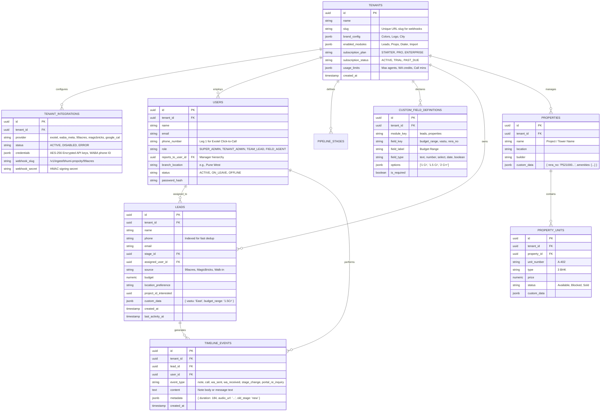

# 🚀 Backend & Database Implementation Plan — Bhumi Propcity CRM

This plan defines the exact PostgreSQL relational database schema, JSONB dynamic custom field architecture, REST API route structure, and integration credential management required to build our scalable Multi-Tenant Real Estate CRM backend.

---

## 🏗️ 1. Database Schema Blueprint (PostgreSQL + JSONB)

Every table enforces Row-Level Security (RLS) via an indexed `tenant_id` UUID column.

---

## 🔌 2. How Modules, Custom Fields & Actions Are Represented in the API

To support dynamic multi-tenancy without modifying backend code when a client adds custom fields or turns on/off modules, the REST API follows a structured pattern:

### A. The Module & Custom Field Configuration API
When the React frontend boots or an agent logs in, it calls:
* `GET /api/v1/workspace/config`
* **Response Payload:** Returns the tenant's brand colors, active subscription limits, `enabled_modules`, pipeline columns, and all `custom_field_definitions`.
* **How Custom Fields are Read/Written:**
  * When fetching a lead (`GET /api/v1/leads/l_102`), the response includes both standard SQL columns (`name`, `phone`) and the dynamic object: `"custom_data": { "vastu": "East", "budget_range": "1.5 Cr" }`.
  * When updating a lead (`PATCH /api/v1/leads/l_102`), the frontend sends updated keys inside `custom_data`. The Zod API validator checks the incoming keys against `custom_field_definitions` for that `tenant_id` to ensure required fields and types match!

### B. Action-Oriented Endpoints (Instead of just CRUD)
For real estate workflows, generic CRUD (`PUT /leads/102`) is insufficient because actions trigger integrations, webhooks, and timeline logs. We use explicit **Action Endpoints**:

| Action Endpoint | HTTP Method | Request Payload | Backend Behavior & Side Effects |
| :--- | :--- | :--- | :--- |
| `/api/v1/leads/{id}/actions/stage-change` | `POST` | `{ "new_stage_id": "stg_3", "note": "Visited project" }` | Updates SQL stage, logs timeline event, checks mandatory note rules. |
| `/api/v1/leads/{id}/actions/call` | `POST` | `{ "agent_id": "usr_55" }` | Looks up agent phone and buyer phone, fires Exotel 2-leg telephony bridge. |
| `/api/v1/leads/{id}/actions/whatsapp` | `POST` | `{ "template_id": "brochure_v1", "params": [...] }` | Decrypts tenant WABA token, calls Meta API, logs timeline event. |
| `/api/v1/leads/{id}/actions/merge` | `POST` | `{ "duplicate_lead_id": "l_809", "merge_strategy": "keep_primary" }` | Re-assigns all timeline notes and call audio from duplicate lead to primary lead, marks duplicate as merged. |

---

## 🏢 3. Tenant Onboarding, Team & Subscription Management

### A. Automated Tenant Onboarding (`POST /api/super/tenants/provision`)
When a new brokerage (e.g., *Bhumi Propcity*) is created in the Control Plane:
1. Inserts row into `tenants` with a generated slug: `slug: "bhumi-propcity"`.
2. Automatically generates unique portal webhook ingress URLs:
   * **99acres Webhook Slug:** `https://api.propcity.io/v1/ingest/bhumi-propcity/99acres`
   * **MagicBricks Webhook Slug:** `https://api.propcity.io/v1/ingest/bhumi-propcity/magicbricks`
3. Seeds default Indian real estate stages (*New Inquiry, Contacted, Site Visit Scheduled, Site Visit Done, Negotiation, Closed Won/Lost*) into `pipeline_stages`.
4. Creates the default Tenant Admin user account in `users`.

### B. Saving Integration Credentials (`tenant_integrations`)
When an Admin sets up WhatsApp or Exotel calling in Settings:
* They paste their `WABA_PHONE_ID`, `META_ACCESS_TOKEN`, and `EXOTEL_SID`.
* Before writing to PostgreSQL, the backend encrypts sensitive tokens using **AES-256-GCM** with a tenant-specific salt.
* When an action endpoint triggers a call or message, the backend decrypts the credentials in memory, executes the API request, and immediately wipes the token from memory.

### C. Team Hierarchy & Branch Management (`users`)
Real estate firms operate in hierarchies across multiple sales offices:
* **Role Enforcement:**
  * `FIELD_AGENT`: Can only view leads assigned to them (`assigned_user_id = auth.user.id`).
  * `TEAM_LEAD`: Can view leads of agents where `reports_to_user_id = auth.user.id`.
  * `TENANT_ADMIN`: Can view all branch data, reassign leads, and access integration settings.
* **Branch Office Tagging:** Users and Leads are tagged by `branch_location` (e.g., *"Pune West"* vs *"Mumbai North"*), allowing branch managers to filter pipeline metrics by location.

### D. Subscription & Usage Governance
SaaS billing and feature limits are enforced at the API Gateway middleware layer:
* **Module Gating:** If `tenant.enabled_modules` does not include `"dialer"`, any request to `/api/v1/leads/{id}/actions/call` immediately rejects with `403 Forbidden (Upgrade Subscription Required)`.
* **Usage Quota Check:** Before sending a WhatsApp brochure or initiating a call, the middleware checks `usage_limits`:
  * *Is `whatsapp_credits_used < whatsapp_credits_limit`?* If exceeded, the API returns a billing warning toast to the agent.

---

## 📦 4. What Else Is Needed for Production? (Essential Supporting Tables)

To make this a complete, bulletproof SaaS, we will add these 3 critical supporting tables:

1. **`lead_routing_rules` (Automated Round-Robin & Duty Roster)**
   * Storing rules: `{ type: "ROUND_ROBIN", source: "99acres", eligible_user_ids: ["usr_1", "usr_2"] }`.
   * When a webhook hits `/v1/ingest/bhumi-propcity/99acres`, the queue worker checks who is active on duty today and assigns the lead equitably!
2. **`import_jobs` (Excel/CSV Async Upload Tracker)**
   * Tracking large spreadsheet migrations: `file_url`, `total_rows: 5000`, `processed_rows: 4200`, `error_log_url`.
   * Prevents HTTP timeouts and lets users download a CSV of invalid rows.
3. **`message_templates` (TRAI DLT & Meta Approved Scripts)**
   * Storing approved SMS DLT template IDs and Meta WABA template structures so field agents cannot send unapproved spam that would get the brokerage’s phone numbers banned by Indian regulators!

---

## ✅ 5. Next Steps for Approval

1. Review the table schema and JSONB custom field approach.
2. Review the Action Endpoint API structure (`/actions/call`, `/actions/whatsapp`).
3. Once approved, we can either:
   * Create the exact SQL migrations and Node.js/TypeScript Express/Fastify server structure in a `/backend` directory.
   * Or lock this into our documentation and finish the remaining frontend screens ready to plug into these exact endpoints!
